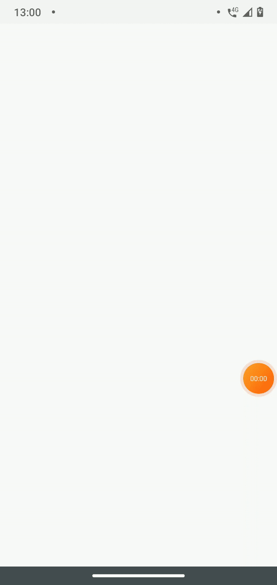

A clone of feed screen of Instagram mobile app using React Native Animated API to optimize the loading.
Initialized using [Basic Rocketseat Template](https://github.com/Rocketseat/react-native-template-rocketseat-basic).

## How can I run it?

Clone the project.
In the project directory, you can run:

### `npm install`

or

### `yarn install`

run to start the static API:

### `yarn json-server server.json -d 1000 -w`

if you are running on android device, is probable that's it does not recognize the localhost:3000, so run the following command to make the connection:

### `adb reverse tcp:3000 tcp:3000`

and then, to run the app:

### `react-native run-(android/ios)`

or

### `yarn (android/ios)`

Than you will get this:

